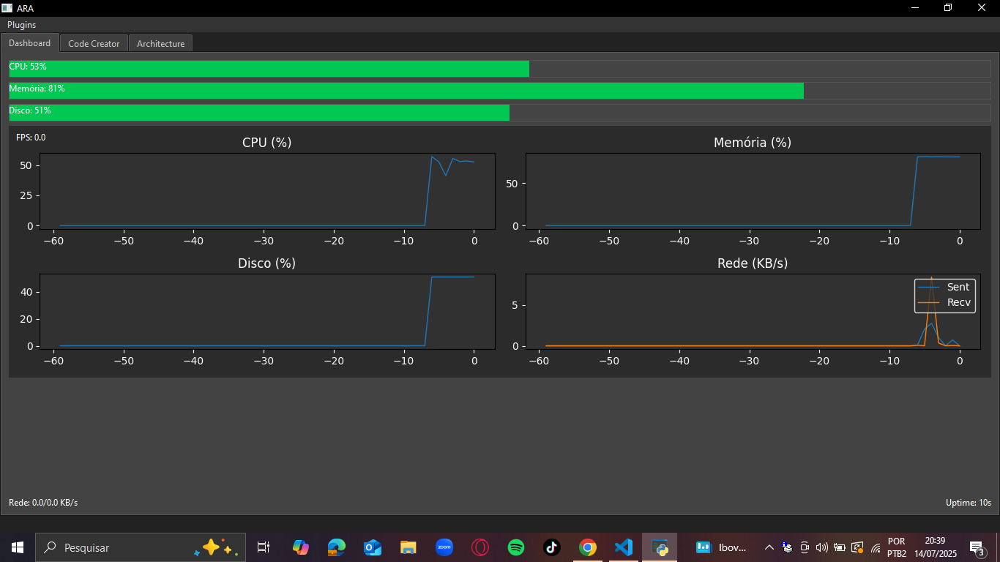

# ARA OS

# 🚀 ARA OS - BETA v. 037


**Smart solution for real-time system monitoring and self-repair**



## 🌟 Main Features

### 📊 Real-Time Dashboard

* Continuous monitoring of CPU, memory, disk, and network
* Historical charts with intuitive visualization
* Accurate network traffic measurement (send/receive)
* System uptime counter

### ⚙️ Architecture Mode (Auto-Remediation)

* **Automatic issue detection:**

  * Processes with high CPU usage
  * Applications with memory leaks
* **Automated actions:**

  * Periodic cleanup of temporary files
  * Scheduled recycle bin emptying
* **Full control:** Approve or reject suggested actions

### ✨ Code Creator

* Integrated Python script editor
* Output console with instant feedback
* Full functionality: New, Open, Save, Run
* Syntax highlighting for better readability

### 🎨 Premium Interface

* Professional dark theme
* Tabbed layout with intuitive navigation
* Smooth animations and visual indicators
* Responsive and adaptable design

## ⚡ How to Run

### Prerequisites:

```bash
Python 3.8+
```

### Installation

```bash
git clone https://github.com/allyxzs/ARAOS.git
cd ARAOS
python main.py
```

## 📜 License

Distributed under the MIT License. See `LICENSE` for more information.

## 🤝 Contributing

Contributions are welcome! You can open an *issue* or submit a *pull request*.

## 👤 Author

Developed by [@allyxzs](https://github.com/allyxzs)

---

ARA OS is an experimental project in constant evolution. Stay tuned for updates and new features!
